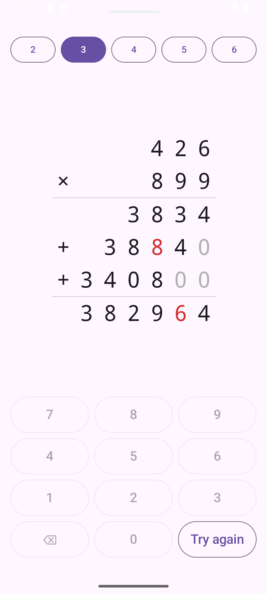

# Mental arithmetic

An Android app for practising multiplication the way it is done by hand. Pick how many
digits the numbers have, type each partial product and the result right to left, and see
what you got wrong: wrong digits in red, missing or extra ones marked.

## Download

**[Download the latest APK](https://github.com/benjamin-lebozec/mental-arithmetic/releases/latest/download/mental-arithmetic.apk)**

Every new version is published on the [releases](https://github.com/benjamin-lebozec/mental-arithmetic/releases)
page, and installs over the one before.

## Install

The app is not on the Play Store, so Android asks you to allow it once:

1. Open the downloaded `mental-arithmetic.apk` on your phone, from the browser's downloads
   or the Files app.
2. When Android says the source is not allowed, tap **Settings** and turn on
   **Allow from this source**, then go back.
3. Tap **Install**. If Play Protect warns about an unknown app, choose **Install anyway**.

To update, download the latest APK again and install it the same way.
